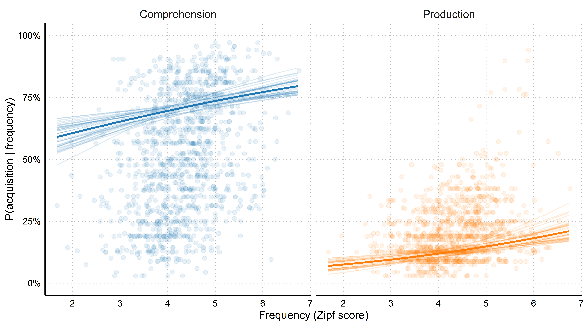
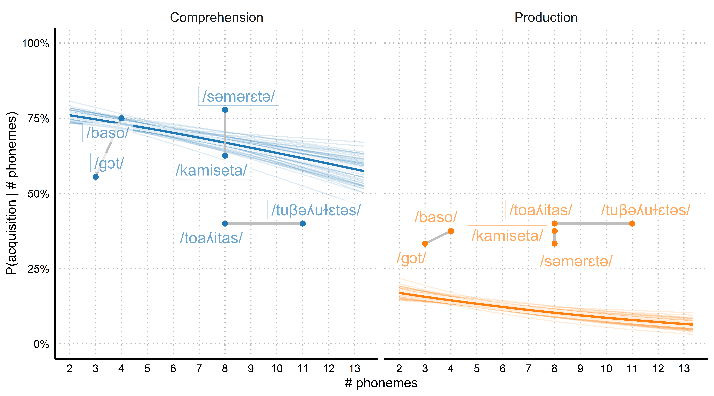
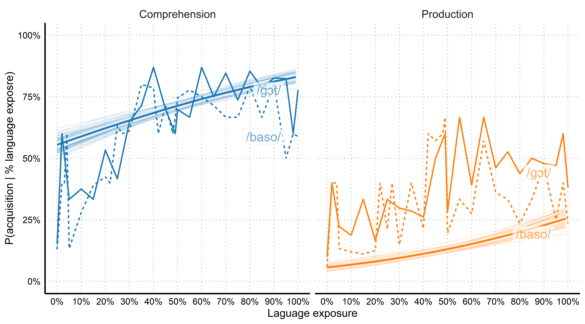

El objetivo de este estudio es estimar la edad de adquisición de palabras en catalán y castellano en una población de niños en edades comprendidas entre 12 y 32 meses de edad. Para ello hemos recogido datos de vocabualrio de participantes de esa edad viviendo en el Area Metropolitana de Barcelona que aprenden catalán y/o castellano, y hemos usado el enfoque de la Teoría de Respuesta al Ítem (insertar referencia) para modelar las curvas de adquisición (comprensión y producción) de palabras en ambas lenguas a través de la edad [@kachergis2021toward].


# Primeras palabras


---

# Cuestionario

**MultiLex** es un cuestionario inspirado en el *McArthur-Bates Communicative Development Inventory* [CDI, @fenson1994variability] en el que presentamos una lista de palabras a las personas a cargo de cada participante. Les pedimos que, para cada palabra, respondan si creen que el participante *No comprende ni dice* la palabra, *Comprende* la palabra o *Comprende y dice* la palabra. Las palabras incluidas son palabras que normalmente aprenden los niños en las edades de interés, aunque varían en su frecuencia léxica (el número de veces que aparecen en el habla natural) y por tanto también en su dificultad. Estas palabras pertenecen a diversas categorías conceptuales/funcionales, como *Comida* o *Adverbios*. Para los análisis de este estudio seleccionamos únicamente palabras de contenido (sustantivos, verbos y adjetivos).

Las familias rellenaron una de las cuatro versiones del cuestionario. Cada version contiene una selección de ~600 palabras diferentes (300 en catalán, 300 en castellano), a excepción de algunas palabras que se repiten a través de las versiones. Las palabras incluidas en castellano son traducciones equivalentes de las palabras en catalán. Más detalles sobre el cuestionario en el repositorio de [multilex](https://github.com/gongcastro/multilex).


```r
df %>%
    distinct(te, list) %>% 
    left_join(
        multilex::pool %>% 
            mutate(
                language = ifelse(grepl("cat_", item), "Catalan", "Spanish"),
                include = as.logical(as.numeric(include)),
                ipa_flat = str_remove_all(ipa, c("\\.|'"))
            )
    ) %>% 
    filter(
        include,
        class %in% c("Noun", "Verb", "Adjective")
    ) %>% 
    unnest(list) %>% 
    mutate(n_phonemes = nchar(ipa_flat)) %>% 
    group_by(list, language) %>% 
    summarise(
        n = n(),
        n_phonemes_mean = mean(n_phonemes, na.rm = TRUE),
        n_phonemes_sd = sd(n_phonemes, na.rm = TRUE),
        n_phonemes_min = min(n_phonemes, na.rm = TRUE),
        n_phonemes_max = max(n_phonemes, na.rm = TRUE),
        frequency_zipf_mean = mean(frequency_zipf, na.rm = TRUE),
        frequency_zipf_sd = sd(frequency_zipf, na.rm = TRUE),
        frequency_zipf_min = min(frequency_zipf, na.rm = TRUE),
        frequency_zipf_max = max(frequency_zipf, na.rm = TRUE),
        .groups = "drop"
    ) %>% 
    gt(
        groupname_col = "language",
        id = "item-table",
        caption = md("**Table 1.** Lexical characteristics of the words included in MultiLex")
    ) %>% 
    tab_spanner("Frequency (Zipf)", starts_with("frequency_")) %>% 
    tab_spanner(md("*N* phonemes"), starts_with("n_phonemes")) %>% 
    fmt_number(columns = matches("mean|sd")) %>% 
    fmt_integer(columns = c("n", matches("min|max"))) %>% 
    cols_label(
        list = "Version",
        n = "N",
        n_phonemes_mean = "Mean",
        n_phonemes_sd = md("*SD*"),
        n_phonemes_min = md("*Min*"),
        n_phonemes_max = md("*Max*"),
        frequency_zipf_mean = "Mean",
        frequency_zipf_sd = md("*SD*"),
        frequency_zipf_min = md("*Min*"),
        frequency_zipf_max = md("*Max*")
    ) %>% 
    tab_style(
        cell_text(weight = "bold"),
        list(
            cells_column_labels(),
            cells_column_spanners()
        )
    ) %>% 
    tab_header(
        title = md("MultiLex items"),
    ) %>% 
    tab_footnote(
        footnote = md("Lexical frequencies are expressed as Zipf scores (3+log10(frequency per million words)"),
        locations = cells_column_spanners(
            spanners = "Frequency (Zipf)"
        )
    )
```

```{=html}
<div id="item-table" style="overflow-x:auto;overflow-y:auto;width:auto;height:auto;">
<style>html {
  font-family: -apple-system, BlinkMacSystemFont, 'Segoe UI', Roboto, Oxygen, Ubuntu, Cantarell, 'Helvetica Neue', 'Fira Sans', 'Droid Sans', Arial, sans-serif;
}

#item-table .gt_table {
  display: table;
  border-collapse: collapse;
  margin-left: auto;
  margin-right: auto;
  color: #333333;
  font-size: 16px;
  font-weight: normal;
  font-style: normal;
  background-color: #FFFFFF;
  width: auto;
  border-top-style: solid;
  border-top-width: 2px;
  border-top-color: #A8A8A8;
  border-right-style: none;
  border-right-width: 2px;
  border-right-color: #D3D3D3;
  border-bottom-style: solid;
  border-bottom-width: 2px;
  border-bottom-color: #A8A8A8;
  border-left-style: none;
  border-left-width: 2px;
  border-left-color: #D3D3D3;
}

#item-table .gt_heading {
  background-color: #FFFFFF;
  text-align: center;
  border-bottom-color: #FFFFFF;
  border-left-style: none;
  border-left-width: 1px;
  border-left-color: #D3D3D3;
  border-right-style: none;
  border-right-width: 1px;
  border-right-color: #D3D3D3;
}

#item-table .gt_title {
  color: #333333;
  font-size: 125%;
  font-weight: initial;
  padding-top: 4px;
  padding-bottom: 4px;
  padding-left: 5px;
  padding-right: 5px;
  border-bottom-color: #FFFFFF;
  border-bottom-width: 0;
}

#item-table .gt_subtitle {
  color: #333333;
  font-size: 85%;
  font-weight: initial;
  padding-top: 0;
  padding-bottom: 6px;
  padding-left: 5px;
  padding-right: 5px;
  border-top-color: #FFFFFF;
  border-top-width: 0;
}

#item-table .gt_bottom_border {
  border-bottom-style: solid;
  border-bottom-width: 2px;
  border-bottom-color: #D3D3D3;
}

#item-table .gt_col_headings {
  border-top-style: solid;
  border-top-width: 2px;
  border-top-color: #D3D3D3;
  border-bottom-style: solid;
  border-bottom-width: 2px;
  border-bottom-color: #D3D3D3;
  border-left-style: none;
  border-left-width: 1px;
  border-left-color: #D3D3D3;
  border-right-style: none;
  border-right-width: 1px;
  border-right-color: #D3D3D3;
}

#item-table .gt_col_heading {
  color: #333333;
  background-color: #FFFFFF;
  font-size: 100%;
  font-weight: normal;
  text-transform: inherit;
  border-left-style: none;
  border-left-width: 1px;
  border-left-color: #D3D3D3;
  border-right-style: none;
  border-right-width: 1px;
  border-right-color: #D3D3D3;
  vertical-align: bottom;
  padding-top: 5px;
  padding-bottom: 6px;
  padding-left: 5px;
  padding-right: 5px;
  overflow-x: hidden;
}

#item-table .gt_column_spanner_outer {
  color: #333333;
  background-color: #FFFFFF;
  font-size: 100%;
  font-weight: normal;
  text-transform: inherit;
  padding-top: 0;
  padding-bottom: 0;
  padding-left: 4px;
  padding-right: 4px;
}

#item-table .gt_column_spanner_outer:first-child {
  padding-left: 0;
}

#item-table .gt_column_spanner_outer:last-child {
  padding-right: 0;
}

#item-table .gt_column_spanner {
  border-bottom-style: solid;
  border-bottom-width: 2px;
  border-bottom-color: #D3D3D3;
  vertical-align: bottom;
  padding-top: 5px;
  padding-bottom: 5px;
  overflow-x: hidden;
  display: inline-block;
  width: 100%;
}

#item-table .gt_group_heading {
  padding-top: 8px;
  padding-bottom: 8px;
  padding-left: 5px;
  padding-right: 5px;
  color: #333333;
  background-color: #FFFFFF;
  font-size: 100%;
  font-weight: initial;
  text-transform: inherit;
  border-top-style: solid;
  border-top-width: 2px;
  border-top-color: #D3D3D3;
  border-bottom-style: solid;
  border-bottom-width: 2px;
  border-bottom-color: #D3D3D3;
  border-left-style: none;
  border-left-width: 1px;
  border-left-color: #D3D3D3;
  border-right-style: none;
  border-right-width: 1px;
  border-right-color: #D3D3D3;
  vertical-align: middle;
}

#item-table .gt_empty_group_heading {
  padding: 0.5px;
  color: #333333;
  background-color: #FFFFFF;
  font-size: 100%;
  font-weight: initial;
  border-top-style: solid;
  border-top-width: 2px;
  border-top-color: #D3D3D3;
  border-bottom-style: solid;
  border-bottom-width: 2px;
  border-bottom-color: #D3D3D3;
  vertical-align: middle;
}

#item-table .gt_from_md > :first-child {
  margin-top: 0;
}

#item-table .gt_from_md > :last-child {
  margin-bottom: 0;
}

#item-table .gt_row {
  padding-top: 8px;
  padding-bottom: 8px;
  padding-left: 5px;
  padding-right: 5px;
  margin: 10px;
  border-top-style: solid;
  border-top-width: 1px;
  border-top-color: #D3D3D3;
  border-left-style: none;
  border-left-width: 1px;
  border-left-color: #D3D3D3;
  border-right-style: none;
  border-right-width: 1px;
  border-right-color: #D3D3D3;
  vertical-align: middle;
  overflow-x: hidden;
}

#item-table .gt_stub {
  color: #333333;
  background-color: #FFFFFF;
  font-size: 100%;
  font-weight: initial;
  text-transform: inherit;
  border-right-style: solid;
  border-right-width: 2px;
  border-right-color: #D3D3D3;
  padding-left: 5px;
  padding-right: 5px;
}

#item-table .gt_stub_row_group {
  color: #333333;
  background-color: #FFFFFF;
  font-size: 100%;
  font-weight: initial;
  text-transform: inherit;
  border-right-style: solid;
  border-right-width: 2px;
  border-right-color: #D3D3D3;
  padding-left: 5px;
  padding-right: 5px;
  vertical-align: top;
}

#item-table .gt_row_group_first td {
  border-top-width: 2px;
}

#item-table .gt_summary_row {
  color: #333333;
  background-color: #FFFFFF;
  text-transform: inherit;
  padding-top: 8px;
  padding-bottom: 8px;
  padding-left: 5px;
  padding-right: 5px;
}

#item-table .gt_first_summary_row {
  border-top-style: solid;
  border-top-color: #D3D3D3;
}

#item-table .gt_first_summary_row.thick {
  border-top-width: 2px;
}

#item-table .gt_last_summary_row {
  padding-top: 8px;
  padding-bottom: 8px;
  padding-left: 5px;
  padding-right: 5px;
  border-bottom-style: solid;
  border-bottom-width: 2px;
  border-bottom-color: #D3D3D3;
}

#item-table .gt_grand_summary_row {
  color: #333333;
  background-color: #FFFFFF;
  text-transform: inherit;
  padding-top: 8px;
  padding-bottom: 8px;
  padding-left: 5px;
  padding-right: 5px;
}

#item-table .gt_first_grand_summary_row {
  padding-top: 8px;
  padding-bottom: 8px;
  padding-left: 5px;
  padding-right: 5px;
  border-top-style: double;
  border-top-width: 6px;
  border-top-color: #D3D3D3;
}

#item-table .gt_striped {
  background-color: rgba(128, 128, 128, 0.05);
}

#item-table .gt_table_body {
  border-top-style: solid;
  border-top-width: 2px;
  border-top-color: #D3D3D3;
  border-bottom-style: solid;
  border-bottom-width: 2px;
  border-bottom-color: #D3D3D3;
}

#item-table .gt_footnotes {
  color: #333333;
  background-color: #FFFFFF;
  border-bottom-style: none;
  border-bottom-width: 2px;
  border-bottom-color: #D3D3D3;
  border-left-style: none;
  border-left-width: 2px;
  border-left-color: #D3D3D3;
  border-right-style: none;
  border-right-width: 2px;
  border-right-color: #D3D3D3;
}

#item-table .gt_footnote {
  margin: 0px;
  font-size: 90%;
  padding-left: 4px;
  padding-right: 4px;
  padding-left: 5px;
  padding-right: 5px;
}

#item-table .gt_sourcenotes {
  color: #333333;
  background-color: #FFFFFF;
  border-bottom-style: none;
  border-bottom-width: 2px;
  border-bottom-color: #D3D3D3;
  border-left-style: none;
  border-left-width: 2px;
  border-left-color: #D3D3D3;
  border-right-style: none;
  border-right-width: 2px;
  border-right-color: #D3D3D3;
}

#item-table .gt_sourcenote {
  font-size: 90%;
  padding-top: 4px;
  padding-bottom: 4px;
  padding-left: 5px;
  padding-right: 5px;
}

#item-table .gt_left {
  text-align: left;
}

#item-table .gt_center {
  text-align: center;
}

#item-table .gt_right {
  text-align: right;
  font-variant-numeric: tabular-nums;
}

#item-table .gt_font_normal {
  font-weight: normal;
}

#item-table .gt_font_bold {
  font-weight: bold;
}

#item-table .gt_font_italic {
  font-style: italic;
}

#item-table .gt_super {
  font-size: 65%;
}

#item-table .gt_two_val_uncert {
  display: inline-block;
  line-height: 1em;
  text-align: right;
  font-size: 60%;
  vertical-align: -0.25em;
  margin-left: 0.1em;
}

#item-table .gt_footnote_marks {
  font-style: italic;
  font-weight: normal;
  font-size: 75%;
  vertical-align: 0.4em;
}

#item-table .gt_asterisk {
  font-size: 100%;
  vertical-align: 0;
}

#item-table .gt_slash_mark {
  font-size: 0.7em;
  line-height: 0.7em;
  vertical-align: 0.15em;
}

#item-table .gt_fraction_numerator {
  font-size: 0.6em;
  line-height: 0.6em;
  vertical-align: 0.45em;
}

#item-table .gt_fraction_denominator {
  font-size: 0.6em;
  line-height: 0.6em;
  vertical-align: -0.05em;
}
</style>
<table class="gt_table">
  <caption><strong>Table 1.</strong> Lexical characteristics of the words included in MultiLex</caption>
  <thead class="gt_header">
    <tr>
      <th colspan="10" class="gt_heading gt_title gt_font_normal gt_bottom_border" style>MultiLex items</th>
    </tr>
    
  </thead>
  <thead class="gt_col_headings">
    <tr>
      <th class="gt_col_heading gt_columns_bottom_border gt_left" rowspan="2" colspan="1" style="font-weight: bold;">Version</th>
      <th class="gt_col_heading gt_columns_bottom_border gt_right" rowspan="2" colspan="1" style="font-weight: bold;">N</th>
      <th class="gt_center gt_columns_top_border gt_column_spanner_outer" rowspan="1" colspan="4" style="font-weight: bold;">
        <span class="gt_column_spanner"><em>N</em> phonemes</span>
      </th>
      <th class="gt_center gt_columns_top_border gt_column_spanner_outer" rowspan="1" colspan="4" style="font-weight: bold;">
        <span class="gt_column_spanner">Frequency (Zipf)<sup class="gt_footnote_marks">1</sup></span>
      </th>
    </tr>
    <tr>
      <th class="gt_col_heading gt_columns_bottom_border gt_right" rowspan="1" colspan="1" style="font-weight: bold;">Mean</th>
      <th class="gt_col_heading gt_columns_bottom_border gt_right" rowspan="1" colspan="1" style="font-weight: bold;"><em>SD</em></th>
      <th class="gt_col_heading gt_columns_bottom_border gt_right" rowspan="1" colspan="1" style="font-weight: bold;"><em>Min</em></th>
      <th class="gt_col_heading gt_columns_bottom_border gt_right" rowspan="1" colspan="1" style="font-weight: bold;"><em>Max</em></th>
      <th class="gt_col_heading gt_columns_bottom_border gt_right" rowspan="1" colspan="1" style="font-weight: bold;">Mean</th>
      <th class="gt_col_heading gt_columns_bottom_border gt_right" rowspan="1" colspan="1" style="font-weight: bold;"><em>SD</em></th>
      <th class="gt_col_heading gt_columns_bottom_border gt_right" rowspan="1" colspan="1" style="font-weight: bold;"><em>Min</em></th>
      <th class="gt_col_heading gt_columns_bottom_border gt_right" rowspan="1" colspan="1" style="font-weight: bold;"><em>Max</em></th>
    </tr>
  </thead>
  <tbody class="gt_table_body">
    <tr class="gt_group_heading_row">
      <td colspan="10" class="gt_group_heading">Catalan</td>
    </tr>
    <tr class="gt_row_group_first"><td class="gt_row gt_left">A</td>
<td class="gt_row gt_right">286</td>
<td class="gt_row gt_right">6.10</td>
<td class="gt_row gt_right">1.94</td>
<td class="gt_row gt_right">2</td>
<td class="gt_row gt_right">15</td>
<td class="gt_row gt_right">4.41</td>
<td class="gt_row gt_right">0.65</td>
<td class="gt_row gt_right">3</td>
<td class="gt_row gt_right">7</td></tr>
    <tr><td class="gt_row gt_left">B</td>
<td class="gt_row gt_right">283</td>
<td class="gt_row gt_right">6.02</td>
<td class="gt_row gt_right">2.00</td>
<td class="gt_row gt_right">2</td>
<td class="gt_row gt_right">15</td>
<td class="gt_row gt_right">4.41</td>
<td class="gt_row gt_right">0.71</td>
<td class="gt_row gt_right">2</td>
<td class="gt_row gt_right">6</td></tr>
    <tr><td class="gt_row gt_left">C</td>
<td class="gt_row gt_right">279</td>
<td class="gt_row gt_right">6.29</td>
<td class="gt_row gt_right">2.06</td>
<td class="gt_row gt_right">2</td>
<td class="gt_row gt_right">15</td>
<td class="gt_row gt_right">4.38</td>
<td class="gt_row gt_right">0.67</td>
<td class="gt_row gt_right">2</td>
<td class="gt_row gt_right">7</td></tr>
    <tr><td class="gt_row gt_left">D</td>
<td class="gt_row gt_right">274</td>
<td class="gt_row gt_right">6.14</td>
<td class="gt_row gt_right">1.92</td>
<td class="gt_row gt_right">2</td>
<td class="gt_row gt_right">15</td>
<td class="gt_row gt_right">4.39</td>
<td class="gt_row gt_right">0.62</td>
<td class="gt_row gt_right">2</td>
<td class="gt_row gt_right">6</td></tr>
    <tr class="gt_group_heading_row">
      <td colspan="10" class="gt_group_heading">Spanish</td>
    </tr>
    <tr class="gt_row_group_first"><td class="gt_row gt_left">A</td>
<td class="gt_row gt_right">286</td>
<td class="gt_row gt_right">6.59</td>
<td class="gt_row gt_right">1.68</td>
<td class="gt_row gt_right">3</td>
<td class="gt_row gt_right">15</td>
<td class="gt_row gt_right">4.28</td>
<td class="gt_row gt_right">0.76</td>
<td class="gt_row gt_right">2</td>
<td class="gt_row gt_right">7</td></tr>
    <tr><td class="gt_row gt_left">B</td>
<td class="gt_row gt_right">283</td>
<td class="gt_row gt_right">6.62</td>
<td class="gt_row gt_right">1.75</td>
<td class="gt_row gt_right">2</td>
<td class="gt_row gt_right">15</td>
<td class="gt_row gt_right">4.27</td>
<td class="gt_row gt_right">0.79</td>
<td class="gt_row gt_right">2</td>
<td class="gt_row gt_right">6</td></tr>
    <tr><td class="gt_row gt_left">C</td>
<td class="gt_row gt_right">279</td>
<td class="gt_row gt_right">6.75</td>
<td class="gt_row gt_right">1.85</td>
<td class="gt_row gt_right">3</td>
<td class="gt_row gt_right">15</td>
<td class="gt_row gt_right">4.24</td>
<td class="gt_row gt_right">0.77</td>
<td class="gt_row gt_right">2</td>
<td class="gt_row gt_right">6</td></tr>
    <tr><td class="gt_row gt_left">D</td>
<td class="gt_row gt_right">274</td>
<td class="gt_row gt_right">6.68</td>
<td class="gt_row gt_right">1.74</td>
<td class="gt_row gt_right">2</td>
<td class="gt_row gt_right">15</td>
<td class="gt_row gt_right">4.24</td>
<td class="gt_row gt_right">0.72</td>
<td class="gt_row gt_right">2</td>
<td class="gt_row gt_right">6</td></tr>
  </tbody>
  
  <tfoot class="gt_footnotes">
    <tr>
      <td class="gt_footnote" colspan="10"><sup class="gt_footnote_marks">1</sup> Lexical frequencies are expressed as Zipf scores (3+log10(frequency per million words)</td>
    </tr>
  </tfoot>
</table>
</div>
```


# Base de datos


La base de datos contiene 254813 observaciones. Cada observación corresponde a la respuesta de un participante a un ítem. Estas observaciones proceden de 465 respuestas al cuestionario, hechas por 390 participantes distintos. Este es el aspecto de la base de datos:


```r
df %>% 
    select(-list) %>% 
    head()
```

```
## # A tibble: 6 x 14
##      te item      lv lv_std  freq freq_std n_phon n_phon_std   doe doe_std id   
##   <int> <chr>  <dbl>  <dbl> <dbl>    <dbl>  <int>      <dbl> <dbl>   <dbl> <chr>
## 1     1 cat_p~ 0.333 -0.127  4.05   -0.367      9       1.99  0.5   0.0253 bile~
## 2     1 cat_p~ 0.333 -0.127  4.05   -0.367      9       1.99  1     1.69   bile~
## 3     1 cat_p~ 0.333 -0.127  4.05   -0.367      9       1.99  0    -1.64   bile~
## 4     1 cat_p~ 0.333 -0.127  4.05   -0.367      9       1.99  0.4  -0.308  bile~
## 5     1 cat_p~ 0.333 -0.127  4.05   -0.367      9       1.99  0.05 -1.47   bile~
## 6     1 cat_p~ 0.333 -0.127  4.05   -0.367      9       1.99  0.3  -0.641  bile~
## # ... with 3 more variables: age <dbl>, age_std <dbl>, response <ord>
```

* **`te`**: identificador de la traducción equivalente. Una traducción equivalente es un par de palabras/items que forman parte de lenguas diferentes pero tienen mismo significado (ej., *porta* y *puerta* en catalán y castellano)
* `item`: identificador del ítem
* `dominance`: variable que codifica si la palabra corresponde a la lengua dominante del participante (*L1*, lengua a la que tiene mayor exposición oral) o a la lengua no dominante del participante (*L2*, lengua a la que tiene menor exposición oral). Por ejemplo, para una participante expuesta 80% del tiempo a Catalán y 20% al castellano, la palabra *porta* (ítem `cat_porta`) será clasificada  como `L1` y la palabra *puerta* (ítem `spa_puerta`) será clasificada  como `L2`^[La estimación del tiempo de exposición a cada lengua es provista por las familias en un cuestionario complementario al inventario de palabras (ver [multilex](https://github.com/gongcastro/multilex))]. El contraste está codificado como `L1` = +0.5 y `L2` = -0.5 [@schad2020capitalize].
* `language`: lengua a la que pertenece la palabra (`Catalan` o `Spanish`)
* `id`: identificador del participante al que pertenece la respuesta. Este identificado es único para cada participante y se repite a través de las multiples respuestas al cuestionario que ha generado el mismo participante, en caso de que haya respondido más de una vez (ej. a los 12 y a los 24 meses)
* `age`: edad del participante al que pertenece la respuestas en meses, calculada como la diferencia en meses entre el día de su nacimiento u el día en el que finalizó el cuestionario
* `age_std`: variable `age` normalizada
* `response`: respuesta generada. Hay tres categorías posibles:
- `No`: el participante no conoce ni dice la palabra. Respuesta codificada como 1.
- `Understands`: el participante conoce la palabra pero no la dice. Respuesta codificada como 2.
- `Understands and Says`: el participante conoce y dice la palabra. Respuesta codificada como 3.


```r
plot_age <- participants %>% 
    mutate(age = floor(age)) %>% 
    count(lp, age) %>% 
    ggplot() +
    aes(
        x = age,
        y = n,
        fill = lp,
        colour = lp
    ) +
    geom_col() +
    labs(
        x = "Edad (meses)",
        y = "Número de respuestas",
        colour = "Grupo",
        fill = "Grupo"
    ) +
    scale_fill_d3() +
    scale_color_d3() +
    scale_x_continuous(
        breaks = seq(
            floor(min(participants$age)), 
            floor(max(participants$age)),
            2
        ),
        sec.axis = dup_axis(
            name = "Edad (años)",
            labels = months_to_years(
                seq(
                    floor(min(participants$age)), 
                    floor(max(participants$age)),
                    2
                )
            )
        ) 
    ) +
    theme(
        panel.grid.major.x = element_blank(),
        panel.grid.minor.x = element_blank()
        
    ) 

plot_doe <- participants %>% 
    mutate(
        dominant_language = if_else(
            doe_catalan >= doe_spanish,
            "Catalan",
            "Spanish"
        ),
        doe_dominant = if_else(
            dominant_language== "Catalan",
            doe_catalan,
            doe_spanish
        ),
        doe_dominant = cut(
            doe_dominant*100,
            breaks = seq(40, 100, 10), 
            ordered_results = TRUE, 
            right = FALSE,
            include.lowest = TRUE
        ),
        doe_dominant = gsub("([0-9.]+)", "\\1%", doe_dominant)
    ) %>% 
    count(lp, dominant_language, doe_dominant) %>% 
    ggplot() +
    aes(
        x = doe_dominant,
        y = n,
        fill = lp,
        colour = lp
    ) +
    geom_col() +
    labs(
        x = "Exposición acumulada a lengua dominante",
        y = "Número de respuestas",
        fill = "Grupo",
        colour = "Grupo"
    ) +
    scale_fill_d3() +
    scale_color_d3() 

plot_time <- participants %>% 
    count(lp, time) %>% 
    ggplot() +
    aes(
        x = as.factor(time),
        y = n,
        colour = lp,
        fill = lp
    ) +
    geom_col() +
    labs(
        x = "Orden de respuesta",
        y = "Número de respuestas",
        colour = "Grupo",
        fill = "Grupo"
    ) +
    scale_color_d3() +
    scale_fill_d3()


plot_age /
    (
        plot_doe + plot_time +
            plot_layout(
                ncol = 2
            )
    ) +
    plot_layout(
        guides = "collect"
        
    ) &
    theme(
        legend.position = "top"
    )
```


---


# Modelo


(hablar de TRI en algún momento) [@burkner2019bayesian]

Estimaremos la de edad de dos tipos de adquisición de cada palabra: comprensión y producción. Operacionalizaremos la edad de adquisición de una palabra como la edad en la que 50% o más de la población reporta comprender o producir la palabra. Para ello, especificaremos un modelo de regresión logística ordinal que predice la probabilidad acumulada de que los participantes marquen *Comprende* o *Comprende y dice* en cada palabra (ver https://cran.r-project.org/web/packages/brms/vignettes/brms_families.html) [@burkner2019ordinal; @agresti2010analysis].

Este modelo asume que cualquiera de las categorías de respuesta son generadas a partir de una distribución latente que representa la dificultad de la palabra. La categoría resultante de la respuesta depende de su dificultad. Cuando la dificultad excede un primer umbral, la respuesta pasa a ser de *No* a *Comprende*, y cuando pasa de un segundo umbral, la respuesta pasa a ser de *Comprende* a *Comprende y dice*. La estimación que realiza el modelo de regresión de cada umbral está representada por dos intersecciones.

Además de las dos intersecciones, el modelo incluye tres predictores: una variable numérica que indica la edad del participante (estandarizada), y una variable categórica que indica si la palabra pertenece a la lengua dominante del participante (`L1`, +0.5) o a su lengua no dominante (`L2`, -0.5), y la interacción en ambas variables. Estos predictores permiten al modelo ajustar los unmbrales de respuesta a la edad y la dominancia de la palabra.

El modelo contiene medidas repetidas diferentes participantes han respondido a la misma traducción y un mismo participante a respondido a diferentes traducciones. Por ello, el modelo tiene una estructura **multinivel** [@gelman2006data] con dos variables de agrupación cruzadas:

* `te`: indica la traducción a la que se responde
* `id`: indica el participante al que pertenece la respuesta

Ambos niveles del modelo de regresión incluyen su propia intersección y su propio coeficiente para los predictores [@barr2013random]. 


$$\begin{aligned}

\nu_{ij} = &\beta_1\mathrm{Edad}_{i} + \beta_2\mathrm{Dominancia}_{ij} + \beta_3 \mathrm{Edad}_{i} \cdot \mathrm{Dominancia}_{ij} +  \\

&\theta_{0j}^{(\mathrm{Ítem})} + \theta_{1j}^{(\mathrm{Ítem})}\mathrm{Edad}_{j} + \theta_{2j}^{(\mathrm{Ítem})} \mathrm{Dominancia}_{ij} + \theta_{3j}^{(\mathrm{Ítem})}\mathrm{Edad}_{j} \cdot \mathrm{Dominancia}_{ij} + \\

&\theta_{0j}^{(\mathrm{ID})} + \theta_{1j}^{(\mathrm{ID})}\mathrm{Edad}_{j} + \theta_{2j}^{(\mathrm{ID})}\mathrm{Dominancia}_{ij} + \theta_{3j}^{(\mathrm{ID})} \mathrm{Edad}_{j} \cdot \mathrm{Dominancia}_{ij}

\end{aligned}$$


$$\begin{aligned}
g[\mathrm{Pr}(y_{ij} \le a_s)] = \tau_s - \nu_{ij}
\end{aligned}$$

donde $s$ refleja la s-ésima categoría de respuesta, $a_1 < a_2 < a_3$ son categorías de respuesta ordenadas, $\mathrm{Pr}(y_i \le a_3) = 1$ y $\tau_s$ son los parámetros umbrales (thresholds) donde $\tau_1 < \tau_2 < \tau_3$.


## Estimación del modelo

Para estimar los coeficientes del modelo de regresión y predecir la edad de adquisición de cada traducción hemos adoptado el enfoque bayesiano. (insertar breve descripción) [@gelman1995bayesian; @mcelreath2020statistical]

Hemos usado el paquete de R brms [@burkner2017brms; @burkner2017advanced] para implementar el modelo bayesiano. Este paquete es una interfaz del lenguaje de programación probabilística Stan [@carpenter2017stan] con el entorno de programación R [@rcoreteam2021language] que implementa Montecarlo Hamiltoniano para explorar la distribución posterior del modelo de forma eficiente. La formula del modelo implementado en brms es la siguiente (ver Anexo para consultar el código de Stan):

```r
response ~ age_std*dominance +
(1 + age_std*dominance | id) +
(1 + age_std*dominance | te),
family = cratio(link = "logit") # cumulative, continuation ratio
```


Hemos ejecutado el modelo especificando los siguientes ajustes:

* Nº de cadenas: 4
* Nº de iteraciones en cada cadena: 2,000 (1,000 de ellas son de calentamiento)
* Parámetro $\Delta$ de adaptación: 0.80
* Profundidad máxima del árbol: 15

## Distribución previa

```r
c(
prior(normal(-0.25, 0.1), class = "Intercept"),
prior(normal(1, 0.1), class = "b", coef = "age_std"),
prior(normal(0, 0.5), class = "b", coef = "dominance1"),
prior(normal(0, 0.5), class = "b", coef = "age_std:dominance1"),
prior(normal(1, 0.1), class = "sd", group = "te"),
prior(normal(1, 0.1), class = "sd", group = "id"),
prior(lkj(2), class = "cor")
)
```


## Distribución previa

---


## Diagnósticos

---


## Distribución posterior


---


# Predicciones posteriores {.tabset}

## Efectos poblacionales

<!-- -->

---


## Frecuencia léxica 


```r
preds_freq_observed <- df %>%
    left_join(select(items, te, item, ipa_flat)) %>% 
    filter(
        te %in% items$te[items$item %in% c(
            c(
                "spa_casa",
                "spa_jirafa",
                "spa_columpiar",
                "spa_mama"
            )
        )]
    ) %>% 
    group_by(te, item, ipa_flat, freq) %>% 
    summarise(
        yes_Production = sum(response=="Understands and Says"),
        yes_Comprehension = sum(response %in% c("Understands", "Understands and Says")),
        n = n(),
        .groups = "drop"
    ) %>% 
    pivot_longer(
        starts_with("yes"),
        names_to = ".category",
        values_to = "sum",
        names_prefix = "yes_"
    ) %>% 
    mutate(
        prop = prop_adj(sum, n),
        prop_se = prop_adj_se(sum, n)
    )

preds_freq %>% 
    ggplot()+
    aes(
        x = freq,
        y = .epred,
        colour = .category
    ) +
    facet_wrap(~.category) +
    geom_line(
        aes(group = .draw),
        alpha = 0.15
    ) +
    stat_summary(
        fun = mean,
        geom = "line",
        size = 3,
        alpha = 0.75,
        colour = "white"
    ) +
    stat_summary(
        fun = mean,
        geom = "line",
        size = 1
    ) +
    geom_line(
        data = preds_freq_observed,
        aes(
            y = prop,
            group = te
        ),
        size = 1,
        colour = "grey"
    ) +
    geom_label_repel(
        data = preds_freq_observed %>% 
            group_by(.category, te, item, ipa_flat, freq) %>% 
            summarise(
                prop = max(prop),
                .groups = "drop"
            ),
        box.padding = 1,
        min.segment.length = 10,
        aes(
            y = prop, 
            label = paste0("/", ipa_flat, "/")
        ),
        size = 5,
        alpha = 0.65,
        label.size = 0,
        label.r = 0,
        fill = "white"
    ) +
    geom_point(
        data = preds_freq_observed,
        aes(
            y = prop, 
        ),
        size = 2
    ) +
    labs(
        x = "Frequency (Zipf score)",
        y = "P(acquisition | frequency)",
        colour = "Category"
    ) +
    scale_color_d3() +
    scale_y_continuous(
        labels = percent,
        limits = c(0, 1)
    ) +
    theme(
        legend.position = "none",
        legend.title = element_blank()
    )
```



---


## Número de fonemas


```r
preds_n_phon_observed <- df %>%
    left_join(select(items, te, item, ipa_flat)) %>% 
    filter(
        te %in% items$te[items$item %in% c(
            c(
                "spa_chapotear",
                "spa_vaso",
                "spa_camiseta",
                "cat_tovalloletes"
            )
        )]
    ) %>% 
    group_by(te, item, ipa_flat, n_phon) %>% 
    summarise(
        yes_Production = sum(response=="Understands and Says"),
        yes_Comprehension = sum(response %in% c("Understands", "Understands and Says")),
        n = n(),
        .groups = "drop"
    ) %>% 
    pivot_longer(
        starts_with("yes"),
        names_to = ".category",
        values_to = "sum",
        names_prefix = "yes_"
    ) %>% 
    mutate(
        prop = prop_adj(sum, n),
        prop_se = prop_adj_se(sum, n)
    )

preds_n_phon %>% 
    ggplot()+
    aes(
        x = n_phon,
        y = .epred,
        colour = .category
    ) +
    facet_wrap(~.category) +
    geom_line(
        aes(group = .draw),
        alpha = 0.15
    ) +
    stat_summary(
        fun = mean,
        geom = "line",
        size = 3,
        alpha = 0.75,
        colour = "white"
    ) +
    stat_summary(
        fun = mean,
        geom = "line",
        size = 1
    ) +
    geom_line(
        data = preds_n_phon_observed,
        aes(
            y = prop,
            group = te
        ),
        size = 1,
        colour = "grey"
    ) +
    geom_label_repel(
        data = preds_n_phon_observed %>% 
            group_by(.category, te, item, ipa_flat, n_phon) %>% 
            summarise(
                prop = max(prop),
                .groups = "drop"
            ),
        box.padding = 1, min.segment.length = 10,
        aes(
            y = prop, 
            label = paste0("/", ipa_flat, "/")
        ),
        size = 5,
        alpha = 0.65,
        label.size = 0,
        label.r = 0,
        fill = "white"
    ) +
    geom_point(
        data = preds_n_phon_observed,
        aes(y = prop),
        size = 2
    ) +
    labs(
        x = "# phonemes",
        y = "P(acquisition | # phonemes)",
        colour = "Category"
    ) +
    scale_color_d3() +
    scale_y_continuous(
        labels = percent,
        limits = c(0, 1)
    ) +
    scale_x_continuous(
        breaks = seq(min(df$n_phon), max(df$n_phon))
    ) +
    theme(
        legend.position = "none",
        legend.title = element_blank()
    )
```



---


## Exposición a la lengua


```r
preds_doe_observed <- df %>%
    left_join(select(items, te, item, ipa_flat)) %>% 
    filter(
        te %in% items$te[items$item %in% c(
            c(
                "cat_got"
            )
        )]
    ) %>% 
    group_by(te, item, ipa_flat, doe) %>% 
    summarise(
        yes_Production = sum(response=="Understands and Says"),
        yes_Comprehension = sum(response %in% c("Understands", "Understands and Says")),
        n = n(),
        .groups = "drop"
    ) %>% 
    pivot_longer(
        starts_with("yes"),
        names_to = ".category",
        values_to = "sum",
        names_prefix = "yes_"
    ) %>% 
    mutate(
        prop = prop_adj(sum, n),
        prop_se = prop_adj_se(sum, n)
    )

preds_doe %>% 
    ggplot()+
    aes(
        x = doe,
        y = .epred,
        colour = .category
    ) +
    facet_wrap(~.category) +
    geom_line(
        aes(group = .draw),
        alpha = 0.15
    ) +
    stat_summary(
        fun = mean,
        geom = "line",
        size = 3,
        alpha = 0.75,
        colour = "white"
    ) +
    stat_summary(
        fun = mean,
        geom = "line",
        size = 1
    ) +
    geom_line(
        data = preds_doe_observed,
        aes(
            y = prop,
            group = item,
            linetype = item
        ),
        size = 0.75
    ) +
    geom_label_repel(
        data = preds_doe_observed %>%
            filter(doe==doe[which.min(0.7-doe)]) %>% 
            group_by(.category, te, item, ipa_flat, doe) %>% 
            summarise(
                prop = max(prop),
                .groups = "drop"
            ),
        box.padding = 1,
        min.segment.length = 10,
        aes(
            y = prop, 
            label = paste0("/", ipa_flat, "/")
        ),
        size = 5,
        alpha = 0.65,
        label.size = 0,
        label.r = 0,
        fill = "white"
    ) +
    labs(
        x = "Laguage exposure",
        y = "P(acquisition | % language exposre)",
        colour = "Category"
    ) +
    scale_color_d3() +
    scale_y_continuous(
        labels = percent,
        limits = c(0, 1)
    ) +
    scale_x_continuous(
        breaks = seq(min(df$doe), max(df$doe), 0.1),
        labels = percent
    ) +
    theme(
        legend.position = "none",
        legend.title = element_blank(),
        panel.grid.minor = element_blank()
    )
```




## {-}


# Conclusiones

---

# Anexos {.tabset}


## Convergencia de cadenas


```r
post %>% 
    mutate(
        .variable_name = str_replace_all(
            .variable,
            c(
                "b_" = "\u03b2: ",
                "sd_te__" = paste0("TE \u03c3: "),
                "sd_id__" = paste0("ID \u03c3: "),
                "cor_te__" = paste0("TE \u03c1: "),
                "cor_id__" = paste0("ID \u03c1: "),
                "__" = " \u00d7 "
            )
            
        )
    ) %>% 
    ggplot() +
    aes(
        x = .iteration,
        y = .value,
        colour = .chain
    ) +
    facet_wrap(
        ~.variable_name,
        scales = "free_y"
    ) + 
    geom_line() +
    labs(
        x = "Iteration",
        y = "Value",
        colour = "Chain"
    ) +
    scale_color_d3()  +
    scale_x_continuous(
        labels = function(x) format(x, big.mark = ",")
    ) +
    theme(
        legend.position = "top",
        panel.grid = element_blank(),
        axis.title.y = element_blank(),
        strip.text = element_text(size = 8),
        axis.text = element_text(size = 6)
    )
```


---

## Convergencia de cadenas (R-hat)


```r
rhats %>% 
    ggplot() +
    aes(
        x = .rhat
    ) +
    # geom_vline(xintercept = 1.1, colour = "grey") +
    geom_histogram(
        fill = pal_d3()(3)[1],
        colour = "white"
    ) +
    scale_y_continuous(
        labels = function(x) format(x, big.mark = ",")
    ) +
    labs(
        title = "Chain convergence",
        subtitle = "Values should not be larger than 1.1",
        x = "Gelman-Rubin statistic (R-hat)",
        y = "Number of samples"
    ) 
```


---

## Tamaño de muestra efectivo


```r
neffs %>% 
    ggplot() +
    aes(
        x = .neff
    ) +
    geom_histogram(
        fill = pal_d3()(1)[1],
        colour = "white"
    ) +
    labs(
        title = "Effective sample size",
        subtitle = "Overall, values should be larger than 1",
        x = "Effective sample size ratio (N eff.)",
        y = "Number of samples"
    ) +
    scale_y_continuous(
        labels = function(x) format(x, big.mark = ",")
    ) +
    theme(
        axis.title.y = element_blank()
    ) 
```


---

## Variabilidad de coeficientes


```r
rand_coefs %>% 
    ggplot() +
    aes(
        x = .value,
        y = reorder(.variable, desc(.variable)),
        colour = group
    ) +
    stat_pointinterval(
        point_size = 2,
        position = position_dodge(width = 0.21)
        
    ) +
    scale_color_d3() +
    labs(
        x = "Sampling space",
        y = "Posterior likelihood density",
        colour = "Group"
    ) +
    scale_x_continuous(
        limits = c(0.5, 0.9),
        labels = percent
    ) +
    theme(
        legend.position = "top",
        panel.grid.major.y = element_blank()
        
    )
```


## Código de Stan

```stan
// generated with brms 2.16.1
functions {
/* compute correlated group-level effects
* Args: 
*   z: matrix of unscaled group-level effects
*   SD: vector of standard deviation parameters
*   L: cholesky factor correlation matrix
* Returns: 
*   matrix of scaled group-level effects
*/ 
matrix scale_r_cor(matrix z, vector SD, matrix L) {
// r is stored in another dimension order than z
return transpose(diag_pre_multiply(SD, L) * z);
}
/* cratio-logit log-PDF for a single response
* Args:
*   y: response category
*   mu: latent mean parameter
*   disc: discrimination parameter
*   thres: ordinal thresholds
* Returns:
*   a scalar to be added to the log posterior
*/
real cratio_logit_lpmf(int y, real mu, real disc, vector thres) {
int nthres = num_elements(thres);
vector[nthres + 1] p;
vector[nthres] q;
int k = 1;
while (k <= min(y, nthres)) {
q[k] = log_inv_logit(disc * (mu - thres[k]));
p[k] = log1m_exp(q[k]);
for (kk in 1:(k - 1)) p[k] = p[k] + q[kk];
k += 1;
}
if (y == nthres + 1) {
p[nthres + 1] = sum(q);
}
return p[y];
}
/* cratio-logit log-PDF for a single response and merged thresholds
* Args:
*   y: response category
*   mu: latent mean parameter
*   disc: discrimination parameter
*   thres: vector of merged ordinal thresholds
*   j: start and end index for the applid threshold within 'thres'
* Returns:
*   a scalar to be added to the log posterior
*/
real cratio_logit_merged_lpmf(int y, real mu, real disc, vector thres, int[] j) {
return cratio_logit_lpmf(y | mu, disc, thres[j[1]:j[2]]);
}
}
data {
int<lower=1> N;  // total number of observations
int Y[N];  // response variable
int<lower=2> nthres;  // number of thresholds
int<lower=1> K;  // number of population-level effects
matrix[N, K] X;  // population-level design matrix
// data for group-level effects of ID 1
int<lower=1> N_1;  // number of grouping levels
int<lower=1> M_1;  // number of coefficients per level
int<lower=1> J_1[N];  // grouping indicator per observation
// group-level predictor values
vector[N] Z_1_1;
vector[N] Z_1_2;
vector[N] Z_1_3;
vector[N] Z_1_4;
vector[N] Z_1_5;
int<lower=1> NC_1;  // number of group-level correlations
// data for group-level effects of ID 2
int<lower=1> N_2;  // number of grouping levels
int<lower=1> M_2;  // number of coefficients per level
int<lower=1> J_2[N];  // grouping indicator per observation
// group-level predictor values
vector[N] Z_2_1;
vector[N] Z_2_2;
vector[N] Z_2_3;
vector[N] Z_2_4;
vector[N] Z_2_5;
int<lower=1> NC_2;  // number of group-level correlations
int prior_only;  // should the likelihood be ignored?
}
transformed data {
int Kc = K;
matrix[N, Kc] Xc;  // centered version of X
vector[Kc] means_X;  // column means of X before centering
for (i in 1:K) {
means_X[i] = mean(X[, i]);
Xc[, i] = X[, i] - means_X[i];
}
}
parameters {
vector[Kc] b;  // population-level effects
vector[nthres] Intercept;  // temporary thresholds for centered predictors
vector<lower=0>[M_1] sd_1;  // group-level standard deviations
matrix[M_1, N_1] z_1;  // standardized group-level effects
cholesky_factor_corr[M_1] L_1;  // cholesky factor of correlation matrix
vector<lower=0>[M_2] sd_2;  // group-level standard deviations
matrix[M_2, N_2] z_2;  // standardized group-level effects
cholesky_factor_corr[M_2] L_2;  // cholesky factor of correlation matrix
}
transformed parameters {
real<lower=0> disc = 1;  // discrimination parameters
matrix[N_1, M_1] r_1;  // actual group-level effects
// using vectors speeds up indexing in loops
vector[N_1] r_1_1;
vector[N_1] r_1_2;
vector[N_1] r_1_3;
vector[N_1] r_1_4;
vector[N_1] r_1_5;
matrix[N_2, M_2] r_2;  // actual group-level effects
// using vectors speeds up indexing in loops
vector[N_2] r_2_1;
vector[N_2] r_2_2;
vector[N_2] r_2_3;
vector[N_2] r_2_4;
vector[N_2] r_2_5;
// compute actual group-level effects
r_1 = scale_r_cor(z_1, sd_1, L_1);
r_1_1 = r_1[, 1];
r_1_2 = r_1[, 2];
r_1_3 = r_1[, 3];
r_1_4 = r_1[, 4];
r_1_5 = r_1[, 5];
// compute actual group-level effects
r_2 = scale_r_cor(z_2, sd_2, L_2);
r_2_1 = r_2[, 1];
r_2_2 = r_2[, 2];
r_2_3 = r_2[, 3];
r_2_4 = r_2[, 4];
r_2_5 = r_2[, 5];
}
model {
// likelihood including constants
if (!prior_only) {
// initialize linear predictor term
vector[N] mu = Xc * b;
for (n in 1:N) {
// add more terms to the linear predictor
mu[n] += r_1_1[J_1[n]] * Z_1_1[n] + r_1_2[J_1[n]] * Z_1_2[n] + r_1_3[J_1[n]] * Z_1_3[n] + r_1_4[J_1[n]] * Z_1_4[n] + r_1_5[J_1[n]] * Z_1_5[n] + r_2_1[J_2[n]] * Z_2_1[n] + r_2_2[J_2[n]] * Z_2_2[n] + r_2_3[J_2[n]] * Z_2_3[n] + r_2_4[J_2[n]] * Z_2_4[n] + r_2_5[J_2[n]] * Z_2_5[n];
}
for (n in 1:N) {
target += cratio_logit_lpmf(Y[n] | mu[n], disc, Intercept);
}
}
// priors including constants
target += normal_lpdf(b[1] | 1, 0.1);
target += normal_lpdf(b[2] | 0, 0.1);
target += normal_lpdf(b[3] | 0, 0.1);
target += normal_lpdf(b[4] | 0, 0.1);
target += normal_lpdf(Intercept | -0.25, 0.1);
target += normal_lpdf(sd_1 | 1, 0.1)
- 5 * normal_lccdf(0 | 1, 0.1);
target += std_normal_lpdf(to_vector(z_1));
target += lkj_corr_cholesky_lpdf(L_1 | 2);
target += normal_lpdf(sd_2 | 1, 0.1)
- 5 * normal_lccdf(0 | 1, 0.1);
target += std_normal_lpdf(to_vector(z_2));
target += lkj_corr_cholesky_lpdf(L_2 | 2);
}
generated quantities {
// compute actual thresholds
vector[nthres] b_Intercept = Intercept + dot_product(means_X, b);
// compute group-level correlations
corr_matrix[M_1] Cor_1 = multiply_lower_tri_self_transpose(L_1);
vector<lower=-1,upper=1>[NC_1] cor_1;
// compute group-level correlations
corr_matrix[M_2] Cor_2 = multiply_lower_tri_self_transpose(L_2);
vector<lower=-1,upper=1>[NC_2] cor_2;
// additionally sample draws from priors
real prior_b_1 = normal_rng(1,0.1);
real prior_b_2 = normal_rng(0,0.1);
real prior_b_3 = normal_rng(0,0.1);
real prior_b_4 = normal_rng(0,0.1);
real prior_Intercept = normal_rng(-0.25,0.1);
real prior_sd_1 = normal_rng(1,0.1);
real prior_cor_1 = lkj_corr_rng(M_1,2)[1, 2];
real prior_sd_2 = normal_rng(1,0.1);
real prior_cor_2 = lkj_corr_rng(M_2,2)[1, 2];
// extract upper diagonal of correlation matrix
for (k in 1:M_1) {
for (j in 1:(k - 1)) {
cor_1[choose(k - 1, 2) + j] = Cor_1[j, k];
}
}
// extract upper diagonal of correlation matrix
for (k in 1:M_2) {
for (j in 1:(k - 1)) {
cor_2[choose(k - 1, 2) + j] = Cor_2[j, k];
}
}
// use rejection sampling for truncated priors
while (prior_sd_1 < 0) {
prior_sd_1 = normal_rng(1,0.1);
}
while (prior_sd_2 < 0) {
prior_sd_2 = normal_rng(1,0.1);
}
}
```

## {-}


# Referencias


