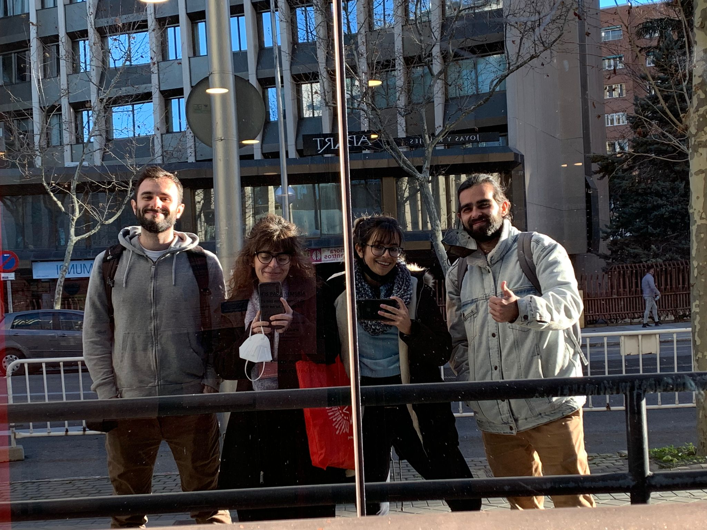

class: title-slide, left, top

## Estimando curvas de adquisición léxica en la infancia

```{r setup, include=FALSE}
options(htmltools.dir.version = FALSE)

# load packages
library(arrow)
library(here)
library(dplyr)
library(tidyr)
library(lubridate)
library(tidybayes)
library(stringr)
library(ggplot2)
library(ggsci)
library(patchwork)
library(brms)
library(gt)
library(scales)
library(ggrepel)
library(multilex)
library(tidytext)
library(papaja)
library(xaringanthemer)
library(fontawesome)
library(showtext)

# load helper functions
source(here("R", "utils.R"))
set.seed(888)
options(htmltools.dir.version = FALSE)


# set ggplot2 theme
theme_set(theme_custom()) # from utils.R
font_add_google("Jost", family = "jost")
showtext_auto()

# load datasets
participants <- read_ipc_stream(here("data", "participants.parquet"))
items <- read_ipc_stream(here("data", "items.parquet"))
df <- read_ipc_stream(here("data", "main.parquet"))
model_fit_4 <- readRDS(here("results", "fit_4.rds"))
model_fit_4_prior <- readRDS(here("results", "fit_4_prior.rds"))
post <- read_ipc_stream(here("results", "posterior_draws.parquet"))
rhats <- read_ipc_stream(here("results", "rhats.parquet"))
neffs <- read_ipc_stream(here("results", "neffs.parquet"))
fix_coefs <- read_ipc_stream(here("results", "fixed_coefs.parquet"))
rand_coefs <- read_ipc_stream(here("results", "rand_coefs.parquet"))
preds_age <- read_ipc_stream(here("results", "posterior_predictions-population.parquet"))
preds_freq <- read_ipc_stream(here("results", "posterior_predictions-frequency.parquet"))
preds_n_phon <- read_ipc_stream(here("results", "posterior_predictions-n_phon.parquet"))
preds_doe <- read_ipc_stream(here("results", "posterior_predictions-doe.parquet"))
aoas <- read_ipc_stream(here("results", "posterior_aoas-population.parquet"))
wordbank_aoas <- read_ipc_stream(here("data", "wordbank-aoa.parquet"))
preds_age_te <- read_ipc_stream(here("results", "posterior_predictions-groups.parquet"))

```


**Gonzalo Garcia-Castro**<sup>1</sup> `r fontawesome::fa("twitter", fill = "#1DA1F2")` `r fontawesome::fa("github", fill = "black")` @gongcastro `r fontawesome::fa("envelope")` gonzalo.garciadecastro@upf.edu

**Alicia Franco-Martínez**<sup>2</sup> `r fontawesome::fa("twitter", fill = "#1DA1F2")` @AliciaFrancoXVE

**Cristina Rodríguez-Prada**<sup>2</sup> `r fontawesome::fa("twitter", fill = "#1DA1F2")` @crodriguezprada

**Ignacio Castillejo**<sup>2</sup> `r fontawesome::fa("twitter", fill = "#1DA1F2")` @IndaloNacho

**Núria Sebastian Galles**<sup>1</sup>

17/07/2022


<a href="https://gongcastro.github.io/aemcco_2022_trajectories" class="github-corner" aria-label="View source on Github"><svg width="80" height="80" viewBox="0 0 250 250" style="fill:#fff; color:#151513; position: absolute; top: 0; border: 0; right: 0;" aria-hidden="true"><path d="M0,0 L115,115 L130,115 L142,142 L250,250 L250,0 Z"></path><path d="M128.3,109.0 C113.8,99.7 119.0,89.6 119.0,89.6 C122.0,82.7 120.5,78.6 120.5,78.6 C119.2,72.0 123.4,76.3 123.4,76.3 C127.3,80.9 125.5,87.3 125.5,87.3 C122.9,97.6 130.6,101.9 134.4,103.2" fill="currentColor" style="transform-origin: 130px 106px;" class="octo-arm"></path><path d="M115.0,115.0 C114.9,115.1 118.7,116.5 119.8,115.4 L133.7,101.6 C136.9,99.2 139.9,98.4 142.2,98.6 C133.8,88.0 127.5,74.4 143.8,58.0 C148.5,53.4 154.0,51.2 159.7,51.0 C160.3,49.4 163.2,43.6 171.4,40.1 C171.4,40.1 176.1,42.5 178.8,56.2 C183.1,58.6 187.2,61.8 190.9,65.4 C194.5,69.0 197.7,73.2 200.1,77.6 C213.8,80.2 216.3,84.9 216.3,84.9 C212.7,93.1 206.9,96.0 205.4,96.6 C205.1,102.4 203.0,107.8 198.3,112.5 C181.9,128.9 168.3,122.5 157.7,114.1 C157.9,116.9 156.7,120.9 152.7,124.9 L141.0,136.5 C139.8,137.7 141.6,141.9 141.8,141.8 Z" fill="currentColor" class="octo-body"></path></svg></a><style>.github-corner:hover .octo-arm{animation:octocat-wave 560ms ease-in-out}@keyframes octocat-wave{0%,100%{transform:rotate(0)}20%,60%{transform:rotate(-25deg)}40%,80%{transform:rotate(10deg)}}@media (max-width:500px){.github-corner:hover .octo-arm{animation:none}.github-corner .octo-arm{animation:octocat-wave 560ms ease-in-out}}</style>


<div class="my-logo-left"></div>

<div class="my-logo-center"></div> 

<div class="my-logo-right"></div> 


```{r xaringan-themer, include=FALSE, warning=FALSE}
style_mono_accent(
    base_color = "#FF7F0E",
    title_slide_background_color = "white",
    title_slide_text_color = "black",
    header_font_google = google_font("Jost"),
    text_font_google = google_font("Jost", "300", "300i"),
    code_font_google = google_font("Fira Mono"),
    text_font_size = 15
)

```

---

# Objetivo

**Estimar la edad de adquisición de palabras en catalán y castellano en el Área Metropolitana de Barcelona**

> Edad de adquisición: edad en la cual existe una representación mental estable, específica y sensible para una palabra (*comprension* o *producción*)

* Obtener características de **estímulos experimentales** (e.g., dificultad)
* Explorar **predictores** de la edad de adquisición de una palabra
* **Portal de consulta** de edad normativa de acquisición


---
class:

# Instrumentos de medida

.pull-left[
### MB-CDI

* Estado general de **desarrollo comunicativo** de un bebé entre los 10 y los 32 meses
* Cumplimentado por una o dos personas a cargo del bebé
* Adaptado a múltiples lenguas: [Wordbank](http://wordbank.stanford.edu/) (http://wordbank.stanford.edu/)
* Inventario de palabras: ~400 ítems
        - No / Comprende (10-16 meses)
        - No / Produce (17-32 meses)
* Tamaño de vocabulario: suma del número de respuestas *Comprende* o *Produce*
* Ej.: 215 palabras, 53.75% comprende, pct 0.78
]

--

.pull-right[
### Multilex

* **`r format(nrow(multilex::pool), big.mark = ",")` ítems** (`r nrow(multilex::pool[multilex::pool$language=="Catalan",])` catalán, `r nrow(multilex::pool[multilex::pool$language=="Spanish",])` castellano)
* Participantes asignados aleatoriamente a una de **cuatro versiones** con ítems parcialmente solapados (~560 items, ~280 catalán ~280 castellano)
* Paquete de R: {[**multilex**](https://gongcastro.github.io/multilex/)} [[GitHub](https://github.com/gongcastro/multilex)]

.center[

]
]


---
class:

# Base de datos

`r length(unique(participants$id))` participantes, `r format(nrow(participants), big.mark = ",")` respuestas,  `r format(nrow(df), big.mark = ",")` observaciones

```{r participants-plot, echo=FALSE, fig.heigh=6, fig.width=15, message=FALSE, warning=FALSE, dpi=1000, out.width="90%", out.height="40%", paged.print=FALSE}

plot_age <- participants %>% 
    mutate(age = floor(age)) %>% 
    count(lp, age) %>% 
    ggplot() +
    aes(
        x = age,
        y = n,
        fill = lp,
        colour = lp
    ) +
    geom_col() +
    labs(
        x = "Edad (meses)",
        y = "# respuestas",
        colour = "Grupo",
        fill = "Grupo"
    ) +
    scale_fill_d3() +
    scale_color_d3() +
    scale_x_continuous(
        breaks = seq(
            floor(min(participants$age)), 
            floor(max(participants$age)),
            2
        ),
        sec.axis = dup_axis(
            name = "Edad (años)",
            labels = months_to_years(
                seq(
                    floor(min(participants$age)), 
                    floor(max(participants$age)),
                    2
                )
            )
        ) 
    ) +
    theme(
        legend.position = "none",
        panel.grid.major.x = element_blank(),
        panel.grid.minor.x = element_blank()
        
    ) 

plot_doe <- participants %>% 
    mutate(
        dominant_language = if_else(
            doe_catalan >= doe_spanish,
            "Catalan",
            "Spanish"
        ),
        doe_dominant = if_else(
            dominant_language== "Catalan",
            doe_catalan,
            doe_spanish
        ),
        doe_dominant = cut(
            doe_dominant*100,
            breaks = seq(40, 100, 10), 
            ordered_results = TRUE, 
            right = FALSE,
            include.lowest = TRUE
        ),
        doe_dominant = gsub("([0-9.]+)", "\\1%", doe_dominant)
    ) %>% 
    count(lp, dominant_language, doe_dominant) %>% 
    ggplot() +
    aes(
        x = doe_dominant,
        y = n,
        fill = lp,
        colour = lp
    ) +
    geom_col() +
    labs(
        x = "Exposición acumulada a lengua dominante",
        y = "# respuestas",
        fill = "Grupo",
        colour = "Grupo"
    ) +
    scale_fill_d3() +
    scale_color_d3() 

plot_time <- participants %>% 
    count(lp, time) %>% 
    ggplot() +
    aes(
        x = as.factor(time),
        y = n,
        colour = lp,
        fill = lp
    ) +
    geom_col() +
    labs(
        x = "Orden de respuesta",
        y = "# respuestas",
        colour = "Grupo",
        fill = "Grupo"
    ) +
    scale_color_d3() +
    scale_fill_d3()


plot_age /
    (
        plot_doe + plot_time +
            plot_layout(
                ncol = 2
            )
    ) +
    plot_layout(
        guides = "collect"
        
    ) &
    theme_custom() &
    theme(
        legend.position = "right",
        legend.title = element_blank()
    )

```


---
class:


.pull-left[
**Variable de respuesta**:
* `response`: *No* = 1, *Comprende* = 2, *Comprende y dice* = 3

**Variables del participante**:

* `id`: identificador de participante (*grupos*)
* `age`: edad en meses
* `doe`: exposición a la lengua (proporción)
]

.pull-right[
**Variables del ítem**:

* `te`: identificador de traducción (*grupos*)
* `item`: identificador de ítem
* `freq`: frecuencia léxica
* `n_phon`: número de fonemas
]

--

<br>

```{r database-head, echo=FALSE, message=FALSE, warning=FALSE, paged.print=FALSE}

df %>% 
    select(id, age, doe, te, item, freq, n_phon, response) %>% 
    arrange(te, age) %>% 
    head(10)

```

---
class:

# Modelo

* **Ordinal**: No &rarr; Comprende &rarr; Comprende y dice) (función de enlace *logit*)
* **Multinivel**: observaciones agrupadas por participant (`id`) e ítem (`te`)
* **Bayesiano**: $P(\theta | y) \propto P(y|\theta) \times P(\theta)$
- $y$ = probabilidad de respuesta a categoría (*No*, *Comprende*, *Comprende y dice*)
- $\theta$ = el modelo y sus parámetros

Implementación en **{brms}/Stan** `r fontawesome::fa("r-project", fill = "steelblue")`:

```r
response ~ age_std + freq_std + n_phon_std + doe_std +
(1 + age_std + freq_std + n_phon_std + doe_std | id) + 
(1 + age_std + freq_std + n_phon_std + doe_std | te),
family = cratio(link = "logit") # cumulative, continuation ratio
)
```


---
class: center

## Distribución previa: predicciones previas

```{r prior-predictions, echo=FALSE, fig.height=5.5, fig.width=8, message=FALSE, warning=FALSE, dpi=1000, out.width="90%", out.width="90%", paged.print=FALSE}

# df_preds <- expand_grid(
#     age_std = seq(-4, 4, 0.1),
#     freq_std = 0,
#     n_phon_std = 0,
#     doe_std = 0
# ) 
# 
# # expected posterior predictions 
# preds <- add_epred_draws(
#     newdata = df_preds, 
#     object = model_fit_4_prior,
#     ndraws = 25,
#     re_formula = NA
# ) %>% 
#     pivot_wider(
#         names_from = .category,
#         values_from = .epred
#     ) %>% 
#     mutate(
#         Understands = Understands + `Understands and Says`
#     ) %>% 
#     pivot_longer(
#         c(No, Understands, `Understands and Says`),
#         names_to = ".category",
#         values_to = ".epred"
#     ) %>% 
#     # get curves of interest
#     filter(.category %in% c("Understands", "Understands and Says")) %>% 
#     # more informative labels
#     mutate(
#         .category = case_when(
#             .category=="Understands" ~ "Comprehension",
#             .category=="Understands and Says" ~ "Production"
#         ),
#         # see R/utils.R
#         age = rescale_variable(age_std, mean = mean(df$age), sd = sd(df$age))
#     ) 
# 
# # empirical response cumulative probabilities
# aoas <- get_aoa(preds, .category) 
# 
# plot_curves <- preds %>%  
#     ggplot() +
#     aes(
#         x = age,
#         y = .epred,
#         shape = .category,
#         linetype = .category,
#         group = .category
#     ) +
#     # linea de referencia (50% suele ser considerado el punto de adquisición)
#     geom_hline(
#         yintercept = 0.5,
#         colour = "grey",
#         alpha = 1
#     ) +
#     # # posterior predictions for each individual posterior draw
#     # stat_summary(
#     #     fun.data = mean_qi,
#     #     geom = "ribbon",
#     #     colour = NA,
#     #     alpha = 0.5
#     # ) +
#     geom_line(
#         aes(group = interaction(.draw, .category , sep = " / ")),
#         alpha = 0.1,
#         size = 0.5,
#         linetype = "solid"
#     ) +
#     stat_summary(
#         fun = mean,
#         aes(group = .category),
#         geom = "line",
#         size  = 1
#     ) +
#     labs(
#         x = "Age (months)",
#         y = "P(acquisition | age)",
#         shape = "Response",
#         linetype = "Response",
#         title = "Acquisition curves",
#         subtitle = "Each line corresponds to a posterior prediction"
#     ) +
#     scale_color_d3() +
#     scale_fill_d3() +
#     scale_y_continuous(
#         labels = percent
#     ) +
#     scale_x_continuous(
#         breaks = seq(0, 45, 5)
#     ) +
#     theme(
#         legend.position = "bottom",
#         panel.grid.major.x = element_line(colour = "grey", linetype = "dotted"),
#         axis.text.x.top = element_text(),
#         axis.title.x.top = element_text(colour = "top"),
#         axis.ticks.x.top = element_line(),
#         axis.title.x.bottom = element_blank(),
#         axis.text.x.bottom = element_blank(),
#         axis.ticks.x.bottom = element_blank(),
#         axis.line.x = element_blank()
#     ) 
# 
# plot_aoas <- aoas %>% 
#     filter(.category != "No") %>% 
#     ggplot() +
#     aes(
#         x = aoa,
#         y = 0,
#         shape = .category
#     ) +
#     annotate(
#         geom = "text",
#         x = c(5, 40),
#         y = -0.1,
#         vjust = -1,
#         hjust = c(1, 0),
#         label = c("Acquired earlier", "Acquired later")
#     ) +
#     annotate(
#         geom = "segment",
#         x = c(5, 40),
#         xend = c(0, 45),
#         y = -0.1,
#         yend = -0.1,
#         arrow = arrow(angle = 30, length = unit(0.2, "cm"))
#     ) +
#     stat_pointinterval(
#         position = position_dodge(width = 0.5),
#         point_interval = mean_qi
#     ) +    
#     labs(
#         x = "Age (months)",
#         y = "Response",
#         title = "Age of acquisition",
#         shape = "Response",
#         linetype = "Response"
#     ) +
#     guides(colour = "none") +
#     scale_x_continuous(
#         limits = c(0, 45),
#         breaks = seq(0, 45, 5)
#     ) +
#     scale_color_d3() +
#     scale_fill_d3() +
#     theme(
#         legend.title = element_blank(),
#         panel.grid.major.y = element_blank(),
#         panel.grid.minor.y = element_blank(),
#         axis.title.y = element_blank(),
#         axis.text.y = element_blank(),
#         axis.ticks.y = element_blank()
#     )
# 
# plot_curves + 
#     plot_aoas +
#     plot_layout(
#         ncol = 1,
#         heights = c(0.8, 0.2),
#         guides = "collect"
#     ) &
#     plot_annotation(
#         title = "Posterior predictions",
#         tag_levels = "A"
#     ) &
#     theme(
#         legend.position = "top"
#     )
# 

```


---
class: center

```{r wordbank-aoa, echo=FALSE, message=FALSE, warning=FALSE, paged.print=FALSE, dpi=1000, out.width="70%", fig.height=5.5, fig.width=8, out.height="50%"}

aoa_summary <- wordbank_aoas %>% 
    group_by(measure) %>% 
    summarise(
        mean_aoa = mean(aoa),
        sd_aoa = sd(aoa),
        .groups = "drop"
    ) 

wordbank_aoas %>% 
    mutate(language_reordered = reorder_within(language, aoa, measure)) %>% 
    ggplot() +
    aes(
        x = aoa,
        y = reorder(language_reordered, aoa),
        xmin = .lower,
        xmax = .upper
    ) +
    facet_wrap(~measure, scales = "free_y") +
    geom_interval() +
    geom_rect(
        data = aoa_summary,
        aes(
            xmin = mean_aoa - sd_aoa,
            xmax = mean_aoa + sd_aoa,
            ymin = -Inf,
            ymax = Inf,
        ) ,
        fill = pal_d3()(2)[2],
        alpha = 0.5,
        inherit.aes = FALSE
    ) +
    geom_point(
        shape = 4,
        size = 2,
        stroke = 0.75,
        colour = "white"
    ) +
    geom_vline(
        data = aoa_summary,
        aes(
            xintercept = mean_aoa,
        ),
        size = 0.75,
        colour = pal_d3()(2)[2]
    ) +
    labs(
        x = "Word age of acquisition (acquired by 50% of sample)",
        y = "Language",
        colour = "Percentile",
        fill = "Percentile",
        title = "Distribution of ages of acquisition across languages",
        subtitle = "Orange lines and intervals indicate grand mean and SD",
        caption = "Source: Wordbank (see https://mikabr.io/aoa-prediction/aoa_estimation.html)"
    ) +
    scale_color_brewer() +
    scale_y_reordered() +
    theme(
        legend.position = "top",
        axis.title.y = element_blank(),
        panel.grid.major.y = element_blank(),
        plot.caption.position = "plot",
        plot.title.position = "plot",
        plot.caption = element_text(hjust = 0)
    )

```


---
class:

# Resultados: Respuestas observadas

```{r response-distribution, echo=FALSE, fig.height=6.5, fig.width=12, message=FALSE, warning=FALSE, dpi=1000, out.width="70%", out.height="65%", paged.print=FALSE}

df %>% 
    mutate(
        age = cut(age, seq(10, 36, 2), include.lowest = TRUE),
        doe = cut(doe, seq(0, 1, 0.25), include.lowest = TRUE)
    ) %>% 
    count(age, doe, response) %>% 
    ggplot() +
    aes(
        age,
        n,
        fill = response
    ) +
    facet_wrap(
        ~doe,
        labeller = label_both
    ) +
    geom_col(
        position = position_fill()
    ) +
    geom_hline(
        yintercept = 0.5,
        size = 1,
        colour = "grey"
    ) +
    labs(
        x = "Edad (meses)",
        y = "Porcentaje de respuestas",
        fill = "Respuesta"
    ) +
    scale_fill_d3() +
    scale_y_continuous(labels = percent) +
    scale_x_discrete(
        guide = guide_axis(n.dodge = 2)
    ) +
    theme(
        legend.position = "top",
        panel.grid = element_blank()
    )

```

---
class:

## Distribución posterior


```{r fixed-coefs, echo=FALSE, fig.height=5, fig.width=8, message=FALSE, warning=FALSE, paged.print=FALSE, out.width="70%", dpi=1000, out.height="40%"}

fix_coefs %>% 
    ggplot() +
    aes(
        x = .value,
        y = reorder(.variable, desc(.variable))
    ) +
    geom_vline(
        xintercept = 0,
        size = 1,
        colour = "grey"
    ) +
    stat_slab(
        aes(
            fill = stat(cut_cdf_qi(cdf, labels = percent))
        ),
        colour = "white"
    ) +
    stat_pointinterval(
        colour = "black"
    ) +
    scale_fill_manual(
        values = c(pal_d3()(1)[1], "#57a9e2", "#aed6f1")
    ) +
    labs(
        x = "Sampling space",
        y = "Posterior likelihood density",
        fill = "Credible Interval"
    ) +
    scale_x_continuous(
        limits = c(-0.2, 1),
        labels = percent
    ) +
    theme(
        legend.position = "top",
        panel.grid.major.y = element_line(colour = "grey"),
        axis.title.y = element_blank()
    )

```

---
class:

## Predicciones posteriores

```{r posterior-preds, echo=FALSE, message=FALSE, warning=FALSE, paged.print=FALSE, out.width="80%", dpi=1000, fig.height=6.5, fig.width=10}

# # empirical response cumulative probabilities
# aoas <- get_aoa(preds, .category, doe_std) %>% 
#     mutate(doe_std = paste0(doe_std, " SD")) 
# 
# 
# observations <- df %>% 
#     mutate(
#         doe_std = cut(
#             doe_std,
#             c(-1, -0.5, 0.5, 1.5),
#             labels = c("-1 SD", "0 SD", "1 SD")
#         ),
#         age_std = cut(
#             age_std,
#             breaks = unique(preds$age_std),
#             labels = unique(preds$age_std)[-1]
#         ) %>% 
#             as.character() %>% 
#             as.numeric()
#     ) %>% 
#     drop_na(doe_std) %>% 
#     group_by(doe_std, age_std) %>% 
#     summarise(
#         yes_Production = sum(response=="Understands and Says"),
#         yes_Comprehension = sum(response %in% c("Understands", "Understands and Says")),
#         n = n(),
#         .groups = "drop"
#     ) %>% 
#     pivot_longer(
#         starts_with("yes"),
#         names_to = ".category",
#         values_to = "sum",
#         names_prefix = "yes_"
#     ) %>% 
#     mutate(
#         prop = prop_adj(sum, n),
#         prop_se = prop_adj_se(sum, n)
#     ) %>% 
#     # group_by(age_std, doe_std, .category) %>% 
#     # summarise(
#     #     prop = mean(prop),
#     #     n = n(),
#     #     .groups = "drop"
#     # ) %>% 
#     mutate(
#         age = rescale_variable(
#             age_std, 
#             mean = mean(df$age), 
#             sd = sd(df$age)
#         ) 
#     )
# 
# 
# plot_curves <- preds_age %>%  
#     mutate(doe_std = paste0(doe_std, " SD")) %>% 
#     ggplot() +
#     aes(
#         x = age,
#         y = .epred,
#         colour = doe_std,
#         fill = doe_std,
#         shape = .category,
#         linetype = .category,
#         group = interaction(doe_std, .category)
#     ) +
#     # linea de referencia (50% suele ser considerado el punto de adquisición)
#     geom_hline(
#         yintercept = 0.5,
#         colour = "grey",
#         alpha = 1
#     ) +
#     # posterior predictions for each individual posterior draw
#     # stat_summary(
#     #     fun.data = mean_qi,
#     #     geom = "ribbon",
#     #     colour = NA,
#     #     alpha = 0.5
#     # ) +
#     geom_line(
#         aes(group = interaction(.draw, doe_std, .category , sep = " / ")),
#         alpha = 0.1,
#         size = 0.5,
#         linetype = "solid"
#     ) +
#     stat_summary(
#         fun = mean,
#         geom = "line",
#         size  = 1
#     ) +
#     # geom_point(
#     #     data = observations,
#     #     aes(y = prop),
#     #     size = 2,
#     #     alpha = 0.5
#     # ) +
#     # geom_line(
#     #     data = observations,
#     #     aes(y = prop, group = interaction(.category, doe_std)),
#     #     size = 0.5,
#     #     alpha = 0.5
# # ) +
# labs(
#     x = "Age (months)",
#     y = "P(acquisition | age, dominance)",
#     colour = "Language exposure",
#     fill = "Language exposure",
#     shape = "Response",
#     linetype = "Response",
#     title = "Acquisition curves",
#     subtitle = "Each line corresponds to a posterior prediction"
# ) +
#     scale_color_d3() +
#     scale_fill_d3() +
#     scale_y_continuous(
#         labels = percent
#     ) +
#     scale_x_continuous(
#         breaks = seq(0, 45, 5)
#     ) +
#     theme(
#         legend.position = "bottom",
#         panel.grid.major.x = element_line(colour = "grey", linetype = "dotted"),
#         axis.text.x.top = element_text(),
#         axis.title.x.top = element_text(colour = "top"),
#         axis.ticks.x.top = element_line(),
#         axis.title.x.bottom = element_blank(),
#         axis.text.x.bottom = element_blank(),
#         axis.ticks.x.bottom = element_blank(),
#         axis.line.x = element_blank()
#     ) 
# 
# plot_aoas <- aoas %>% 
#     filter(.category != "No") %>% 
#     ggplot() +
#     aes(
#         x = aoa,
#         y = 0,
#         colour = doe_std,
#         shape = .category
#     ) +
#     annotate(
#         geom = "text",
#         x = c(5, 40),
#         y = -0.1,
#         vjust = -1,
#         hjust = c(1, 0),
#         label = c("Acquired earlier", "Acquired later")
#     ) +
#     annotate(
#         geom = "segment",
#         x = c(5, 40),
#         xend = c(0, 45),
#         y = -0.1,
#         yend = -0.1,
#         arrow = arrow(angle = 30, length = unit(0.2, "cm"))
#     ) +
#     stat_pointinterval(
#         position = position_dodge(width = 0.5),
#         point_interval = mean_qi
#     ) +    
#     labs(
#         x = "Age (months)",
#         y = "Response",
#         title = "Age of acquisition",
#         shape = "Response",
#         linetype = "Response"
#     ) +
#     guides(colour = "none") +
#     scale_x_continuous(
#         limits = c(0, 45),
#         breaks = seq(0, 45, 5)
#     ) +
#     scale_color_d3() +
#     scale_fill_d3() +
#     theme(
#         legend.title = element_blank(),
#         panel.grid.major.y = element_blank(),
#         panel.grid.minor.y = element_blank(),
#         axis.title.y = element_blank(),
#         axis.text.y = element_blank(),
#         axis.ticks.y = element_blank()
#     )
# 
# plot_curves + 
#     plot_aoas +
#     plot_layout(
#         ncol = 1,
#         heights = c(0.8, 0.2),
#         guides = "collect"
#     ) &
#     plot_annotation(
#         tag_levels = "A"
#     ) & 
#     theme(
#         legend.position = "top"
#     )

```

---
class:

## Predicciones posteriores (2)

```{r post-preds-freq, message=FALSE, warning=FALSE, include=FALSE, paged.print=FALSE, dpi=1000, out.height="70%", out.width="80%", fig.height=5, fig.width=9}

preds_freq_observed <- df %>%
    left_join(select(items, item, ipa_flat)) %>% 
    filter(
        between(age_std, -0.5, 0.5),
        between(doe_std, -0.5, 0.5),
        item %in% c(
            "spa_casa",
            "spa_jirafa",
            "cat_girafa",
            "spa_silla",
            "cat_planta",
            "spa_cangrejo",
            "cat_fatigos"
        )
    ) %>%
    group_by(item, ipa_flat, freq) %>% 
    summarise(
        yes_Production = sum(response=="Understands and Says"),
        yes_Comprehension = sum(response %in% c("Understands", "Understands and Says")),
        n = n(),
        .groups = "drop"
    ) %>% 
    pivot_longer(
        starts_with("yes"),
        names_to = ".category",
        values_to = "sum",
        names_prefix = "yes_"
    ) %>% 
    mutate(
        prop = prop_adj(sum, n),
        prop_se = prop_adj_se(sum, n)
    )

plot_preds_freq <- preds_freq %>% 
    ggplot()+
    aes(
        x = freq,
        y = .epred,
        colour = .category
    ) +
    geom_line(
        aes(group = interaction(.draw, .category)),
        alpha = 0.15
    ) +
    stat_summary(
        aes(group = interaction(.category)),
        fun = mean,
        geom = "line",
        size = 3,
        alpha = 0.75,
        colour = "white"
    ) +
    stat_summary(
        aes(group = interaction(.category)),
        fun = mean,
        geom = "line",
        size = 1
    ) +
    # geom_label_repel(
    #     data = preds_freq_observed %>%
    #         group_by(.category, te, item, ipa_flat, freq) %>%
    #         summarise(
    #             prop = max(prop),
    #             .groups = "drop"
    #         ),
    #     box.padding = 1,
    #     min.segment.length = 10,
    #     aes(
    #         y = prop,
#         label = paste0("/", ipa_flat, "/")
#     ),
#     size = 5,
#     alpha = 0.65,
#     label.size = 0,
#     label.r = 0,
#     fill = "white"
# ) +
geom_label(
    data = preds_freq_observed %>%
        group_by(.category, item, ipa_flat, freq) %>%
        summarise(
            prop = max(prop),
            .groups = "drop"
        ),       
    aes(
        y = prop,
        label = paste0("/", ipa_flat, "/")
    ),
    size = 4,
    fill = "white",
    alpha = 0.65,
    label.size = 0,
    show.legend = FALSE,
    label.r = unit(0, "lines")
) +
    labs(
        x = "Frequency (Zipf score)",
        y = "P(acquisition | frequency)",
        colour = "Category",
        fill = "Category"
        
    ) +
    scale_color_d3() +
    scale_y_continuous(
        labels = percent,
        limits = c(0, 1)
    ) +
    theme(
        legend.title = element_blank()
    )

```


```{r post-preds-phon, message=FALSE, warning=FALSE, include=FALSE, paged.print=FALSE}

preds_n_phon_observed <- df %>%
    left_join(select(items, item, ipa_flat)) %>% 
    filter(
        item %in% c(
            "spa_sol",
            "spa_vaso",
            "spa_camiseta",
            "cat_tovalloletes",
            "cat_excavadora",
            "cat_cremallera"
        )
    ) %>% 
    group_by(item, ipa_flat, n_phon) %>% 
    summarise(
        yes_Production = sum(response=="Understands and Says"),
        yes_Comprehension = sum(response %in% c("Understands", "Understands and Says")),
        n = n(),
        .groups = "drop"
    ) %>% 
    pivot_longer(
        starts_with("yes"),
        names_to = ".category",
        values_to = "sum",
        names_prefix = "yes_"
    ) %>% 
    mutate(
        prop = prop_adj(sum, n),
        prop_se = prop_adj_se(sum, n)
    )

plot_preds_n_phon <- preds_n_phon %>% 
    ggplot()+
    aes(
        x = n_phon,
        y = .epred,
        colour = .category
    ) +
    geom_line(
        aes(group = interaction(.draw, .category)),
        alpha = 0.15
    ) +
    stat_summary(
        aes(group = interaction(.category)),
        fun = mean,
        geom = "line",
        size = 3,
        alpha = 0.75,
        colour = "white"
    ) +
    stat_summary(
        aes(group = .category),
        fun = mean,
        geom = "line",
        size = 1
    ) +
    geom_label(
        data = preds_n_phon_observed %>%
            group_by(.category, item, ipa_flat, n_phon) %>%
            summarise(
                prop = max(prop),
                .groups = "drop"
            ),       
        aes(
            y = prop,
            label = paste0("/", ipa_flat, "/")
        ),
        size = 4,
        fill = "white",
        alpha = 0.65,
        label.size = 0,
        show.legend = FALSE,
        label.r = unit(0, "lines")
    ) +
    labs(
        x = "# phonemes",
        y = "P(acquisition | # phonemes)",
        colour = "Category",
        fill = "Category"
    ) +
    scale_color_d3() +
    scale_y_continuous(
        labels = percent,
        limits = c(0, 1)
    ) +
    scale_x_continuous(
        breaks = seq(2, 14, 2)
    ) +
    theme(
        legend.title = element_blank()
    )


```


```{r post-preds-doe, message=FALSE, warning=FALSE, include=FALSE, paged.print=FALSE}

preds_doe_observed <- df %>%
    left_join(select(items, item, ipa_flat)) %>% 
    filter(
        item %in% c(
            "spa_mesa"
        )
    ) %>% 
    group_by(item, ipa_flat, doe) %>% 
    summarise(
        yes_Production = sum(response=="Understands and Says"),
        yes_Comprehension = sum(response %in% c("Understands", "Understands and Says")),
        n = n(),
        .groups = "drop"
    ) %>% 
    pivot_longer(
        starts_with("yes"),
        names_to = ".category",
        values_to = "sum",
        names_prefix = "yes_"
    ) %>% 
    mutate(
        prop = prop_adj(sum, n),
        prop_se = prop_adj_se(sum, n)
    )

plot_preds_doe <- preds_doe %>% 
    ggplot()+
    aes(
        x = doe,
        y = .epred,
        colour = .category
    ) +
    geom_line(
        aes(group = interaction(.draw, .category)),
        alpha = 0.15
    ) +
    stat_summary(
        aes(group = .category),
        fun = mean,
        geom = "line",
        size = 3,
        alpha = 0.75,
        colour = "white"
    ) +
    stat_summary(
        aes(group = .category),
        fun = mean,
        geom = "line",
        size = 1
    ) +
    geom_line(
        data = preds_doe_observed,
        aes(
            y = prop,
            group = interaction(.category, item)
        ),
        size = 0.5,
        alpha = 0.5
    ) +
    geom_label(
        data = preds_doe_observed %>%
            group_by(.category, item, ipa_flat, doe) %>%
            summarise(
                prop = max(prop),
                .groups = "drop"
            ),       
        aes(
            x = 0.8,
            y = ifelse(.category=="Comprehension", 0.80, 0.25),
            label = paste0("/", ipa_flat, "/")
        ),
        show.legend = FALSE,
        size = 4,
        fill = "white",
        alpha = 0.65,
        label.size = 0,
        label.r = unit(0, "lines")
    ) +    
    labs(
        x = "Language exposure",
        y = "P(acquisition | % language exposre)",
        colour = "Category",
        fill = "Category"
    ) +
    scale_color_d3() +
    scale_y_continuous(
        labels = percent,
        limits = c(0, 1)
    ) +
    scale_x_continuous(
        breaks = seq(min(df$doe), max(df$doe), 0.25),
        labels = percent
    ) +
    theme(
        legend.title = element_blank(),
        panel.grid.minor = element_blank()
    )

```


```{r post-preds-predictors, echo=FALSE, message=FALSE, warning=FALSE, paged.print=FALSE, dpi=1000, out.width="90%", fig.height=5, fig.width=12}

# plot_preds_freq + 
#     plot_preds_n_phon + 
#     plot_preds_doe +
#     plot_layout(
#         guides = "collect"
#     ) & 
#     theme(
#         legend.position = "top"
#     )

```

---
class:

```{r post-preds-item-casa, echo=FALSE, message=FALSE, warning=FALSE, paged.print=FALSE, dpi=1000, fig.height="70%", fig.width="80%"}


aoas_te <- get_aoa(preds_age_te, .category, doe_std, te, item, freq, n_phon) %>% 
    mutate(doe_std = paste0(doe_std, " SD")) 

plot_curves_te <- preds_age_te %>%
    filter(te %in% items$te[items$item=="cat_casa"]) %>% 
    mutate(
        doe_std = paste0(doe_std, " SD"),
        item = paste0(
            item, 
            " / freq = ", round(freq, 2),
            " / n_phon = ", n_phon
        ) 
    ) %>% 
    ggplot() +
    facet_wrap(~item) +
    aes(
        x = age,
        y = .epred,
        colour = doe_std,
        fill = doe_std,
        linetype = .category
    ) +
    geom_line(
        aes(group = interaction(.draw, .category, doe_std)),
        alpha = 0.15,
        size = 0.5,
        linetype = "solid"
    ) +
    stat_summary(
        fun = mean,
        geom = "line",
        colour = "white",
        aes(group = interaction(doe_std, .category)),
        size = 1,
        linetype = "solid"
    ) +
    stat_summary(
        geom = "line",
        fun = mean,
        size = 0.95,
    ) +
    labs(
        x = "Age (months)",
        y = "Posterior P(Acquisition | model)",
        colour = "Language exposure",
        fill = "Language exposure"
    ) +
    scale_color_d3() +
    scale_y_continuous(labels = scales::percent) +
    guides(linetype = guide_legend(title = NULL)) +
    theme(
        legend.position = "top"
    )

plot_aoas_te <- aoas_te %>%
    filter(te %in% items$te[items$item=="cat_casa"]) %>% 
    filter(.category != "No") %>%
    ggplot() +
    aes(
        x = aoa,
        y = 0,
        colour = doe_std,
        shape = .category
    ) +
    facet_wrap(~item) +
    stat_pointinterval(
        position = position_dodge(width = 0.5),
        point_interval = mean_qi
    ) +
    labs(
        x = "Age (months)",
        y = "Response",
        title = "Age of acquisition",
        shape = "Response",
        linetype = "Response"
    ) +
    guides(colour = "none") +
    scale_x_continuous(
        limits = c(0, 45),
        breaks = seq(0, 45, 5)
    ) +
    scale_color_d3() +
    scale_fill_d3() +
    theme(
        legend.title = element_blank(),
        panel.grid.major.y = element_blank(),
        panel.grid.minor.y = element_blank(),
        axis.title.y = element_blank(),
        axis.text.y = element_blank(),
        axis.ticks.y = element_blank()
    )

plot_curves_te +
    plot_aoas_te +
    plot_layout(
        ncol = 1,
        heights = c(0.8, 0.2),
        guides = "collect"
    ) &
    plot_annotation(
        tag_levels = "A"
    ) &
    theme(
        legend.position = "top"
    )


```

---
class:

```{r post-preds-item-gato, echo=FALSE, message=FALSE, warning=FALSE, paged.print=FALSE}


aoas_te <- get_aoa(preds_age_te, .category, doe_std, te, item, freq, n_phon) %>% 
    mutate(doe_std = paste0(doe_std, " SD")) 

plot_curves_te <- preds_age_te %>%
    filter(te %in% items$te[items$item=="cat_gat"]) %>% 
    mutate(
        doe_std = paste0(doe_std, " SD"),
        item = paste0(
            item, 
            " / freq = ", round(freq, 2),
            " / n_phon = ", n_phon
        ) 
    ) %>% 
    ggplot() +
    facet_wrap(~item) +
    aes(
        x = age,
        y = .epred,
        colour = doe_std,
        fill = doe_std,
        linetype = .category
    ) +
    geom_line(
        aes(group = interaction(.draw, .category, doe_std)),
        alpha = 0.15,
        size = 0.5,
        linetype = "solid"
    ) +
    stat_summary(
        fun = mean,
        geom = "line",
        colour = "white",
        aes(group = interaction(doe_std, .category)),
        size = 1,
        linetype = "solid"
    ) +
    stat_summary(
        geom = "line",
        fun = mean,
        size = 0.95,
    ) +
    labs(
        x = "Age (months)",
        y = "Posterior P(Acquisition | model)",
        colour = "Language exposure",
        fill = "Language exposure"
    ) +
    scale_color_d3() +
    scale_y_continuous(labels = scales::percent) +
    guides(linetype = guide_legend(title = NULL)) +
    theme(
        legend.position = "top"
    )

plot_aoas_te <- aoas_te %>%
    filter(te %in% items$te[items$item=="cat_gat"]) %>% 
    filter(.category != "No") %>%
    ggplot() +
    aes(
        x = aoa,
        y = 0,
        colour = doe_std,
        shape = .category
    ) +
    facet_wrap(~item) +
    stat_pointinterval(
        position = position_dodge(width = 0.5),
        point_interval = mean_qi
    ) +
    labs(
        x = "Age (months)",
        y = "Response",
        title = "Age of acquisition",
        shape = "Response",
        linetype = "Response"
    ) +
    guides(colour = "none") +
    scale_x_continuous(
        limits = c(0, 45),
        breaks = seq(0, 45, 5)
    ) +
    scale_color_d3() +
    scale_fill_d3() +
    theme(
        legend.title = element_blank(),
        panel.grid.major.y = element_blank(),
        panel.grid.minor.y = element_blank(),
        axis.title.y = element_blank(),
        axis.text.y = element_blank(),
        axis.ticks.y = element_blank()
    )

plot_curves_te +
    plot_aoas_te +
    plot_layout(
        ncol = 1,
        heights = c(0.8, 0.2),
        guides = "collect"
    ) &
    plot_annotation(
        tag_levels = "A"
    ) &
    theme(
        legend.position = "top"
    )


```


---
class:

```{r post-preds-item-cocodrilo, echo=FALSE, message=FALSE, warning=FALSE, paged.print=FALSE}


aoas_te <- get_aoa(preds_age_te, .category, doe_std, te, item, freq, n_phon) %>% 
    mutate(doe_std = paste0(doe_std, " SD")) 

plot_curves_te <- preds_age_te %>%
    filter(te %in% items$te[items$item=="spa_cocodrilo"]) %>% 
    mutate(
        doe_std = paste0(doe_std, " SD"),
        item = paste0(
            item, 
            " / freq = ", round(freq, 2),
            " / n_phon = ", n_phon
        ) 
    ) %>% 
    ggplot() +
    facet_wrap(~item) +
    aes(
        x = age,
        y = .epred,
        colour = doe_std,
        fill = doe_std,
        linetype = .category
    ) +
    geom_line(
        aes(group = interaction(.draw, .category, doe_std)),
        alpha = 0.15,
        size = 0.5,
        linetype = "solid"
    ) +
    stat_summary(
        fun = mean,
        geom = "line",
        colour = "white",
        aes(group = interaction(doe_std, .category)),
        size = 1,
        linetype = "solid"
    ) +
    stat_summary(
        geom = "line",
        fun = mean,
        size = 0.95,
    ) +
    labs(
        x = "Age (months)",
        y = "Posterior P(Acquisition | model)",
        colour = "Language exposure",
        fill = "Language exposure"
    ) +
    scale_color_d3() +
    scale_y_continuous(labels = scales::percent) +
    guides(linetype = guide_legend(title = NULL)) +
    theme(
        legend.position = "top"
    )

plot_aoas_te <- aoas_te %>%
    filter(te %in% items$te[items$item=="spa_cocodrilo"]) %>% 
    filter(.category != "No") %>%
    ggplot() +
    aes(
        x = aoa,
        y = 0,
        colour = doe_std,
        shape = .category
    ) +
    facet_wrap(~item) +
    stat_pointinterval(
        position = position_dodge(width = 0.5),
        point_interval = mean_qi
    ) +
    labs(
        x = "Age (months)",
        y = "Response",
        title = "Age of acquisition",
        shape = "Response",
        linetype = "Response"
    ) +
    guides(colour = "none") +
    scale_x_continuous(
        limits = c(0, 45),
        breaks = seq(0, 45, 5)
    ) +
    scale_color_d3() +
    scale_fill_d3() +
    theme(
        legend.title = element_blank(),
        panel.grid.major.y = element_blank(),
        panel.grid.minor.y = element_blank(),
        axis.title.y = element_blank(),
        axis.text.y = element_blank(),
        axis.ticks.y = element_blank()
    )

plot_curves_te +
    plot_aoas_te +
    plot_layout(
        ncol = 1,
        heights = c(0.8, 0.2),
        guides = "collect"
    ) &
    plot_annotation(
        tag_levels = "A"
    ) &
    theme(
        legend.position = "top"
    )


```

---
class:

# Conclusiones

---
class:

# Anexo 1: convergencia de cadenas

```{r chain-convergence, echo=FALSE, message=FALSE, warning=FALSE, paged.print=FALSE, dpi=1000, out.width="90%", fig.width=13, fig.height=6.5, eval=FALSE}
post %>% 
    mutate(
        .variable_name = str_replace_all(
            .variable,
            c(
                "b_" = "\u03b2: ",
                "sd_te__" = paste0("TE \u03c3: "),
                "sd_id__" = paste0("ID \u03c3: "),
                "cor_te__" = paste0("TE \u03c1: "),
                "cor_id__" = paste0("ID \u03c1: "),
                "__" = " \u00d7 "
            )
            
        )
    ) %>% 
    ggplot() +
    aes(
        x = .iteration,
        y = .value,
        colour = .chain
    ) +
    facet_wrap(
        ~.variable_name,
        scales = "free_y"
    ) + 
    geom_line() +
    labs(
        x = "Iteration",
        y = "Value",
        colour = "Chain"
    ) +
    scale_color_d3()  +
    scale_x_continuous(
        labels = function(x) format(x, big.mark = ",")
    ) +
    theme(
        legend.position = "top",
        panel.grid = element_blank(),
        axis.title.y = element_blank(),
        strip.text = element_text(size = 8),
        axis.text = element_text(size = 6)
    )

```

---

# Anexo 2: convergencia de cadenas

```{r diagnostics-rhats, echo=FALSE, message=FALSE, warning=FALSE, paged.print=FALSE, dpi=1000, out.width="90%", out.height="80%", fig.height=4, fig.width=10}
rhats %>% 
    ggplot() +
    aes(
        x = .rhat
    ) +
    # geom_vline(xintercept = 1.1, colour = "grey") +
    geom_histogram(
        fill = pal_d3()(3)[1],
        colour = "white"
    ) +
    scale_y_continuous(
        labels = function(x) format(x, big.mark = ",")
    ) +
    labs(
        title = "Chain convergence",
        subtitle = "Values should not be larger than 1.1",
        x = "Gelman-Rubin statistic (R-hat)",
        y = "Number of samples"
    ) 
```

---

# Anexo 3: tamaño de muestra efectivo

```{r diagnostics-neffs, echo=FALSE, message=FALSE, warning=FALSE, paged.print=FALSE, dpi=1000, out.width="90%", out.height="80%", fig.height=4, fig.width=10, eval=FALSE}
neffs %>% 
    ggplot() +
    aes(
        x = .neff
    ) +
    geom_histogram(
        fill = pal_d3()(1)[1],
        colour = "white"
    ) +
    geom_vline(
        xintercept = 1,
        colour = pal_d3()(2)[2],
        size = 1
    ) +
    labs(
        title = "Effective sample size",
        subtitle = "Overall, values should be larger than 1",
        x = "Effective sample size ratio (N eff.)",
        y = "Number of samples"
    ) +
    scale_y_continuous(
        labels = function(x) format(x, big.mark = ",")
    ) +
    theme(
        axis.title.y = element_blank()
    ) 
```

---

# Anexo 4: Variabilidad de coeficientes

```{r rand-coefs, echo=FALSE, message=FALSE, warning=FALSE, paged.print=FALSE, dpi=1000, out.width="90%", fig.height=4.5, fig.width=10, eval=FALSE}

rand_coefs %>% 
    ggplot() +
    aes(
        x = .value,
        y = reorder(.variable, desc(.variable)),
        colour = group
    ) +
    stat_pointinterval(
        point_size = 2,
        position = position_dodge(width = 0.21)
        
    ) +
    scale_color_d3() +
    labs(
        x = "Sampling space",
        y = "Posterior likelihood density",
        colour = "Group"
    ) +
    scale_x_continuous(
        limits = c(0.5, 0.9),
        labels = percent
    ) +
    theme(
        legend.position = "top",
        panel.grid.major.y = element_blank(),
        legend.title = element_blank()
        
    )

```

---
class:

# ¡Gracias!

.pull-right[

]

.pull-left[

]


